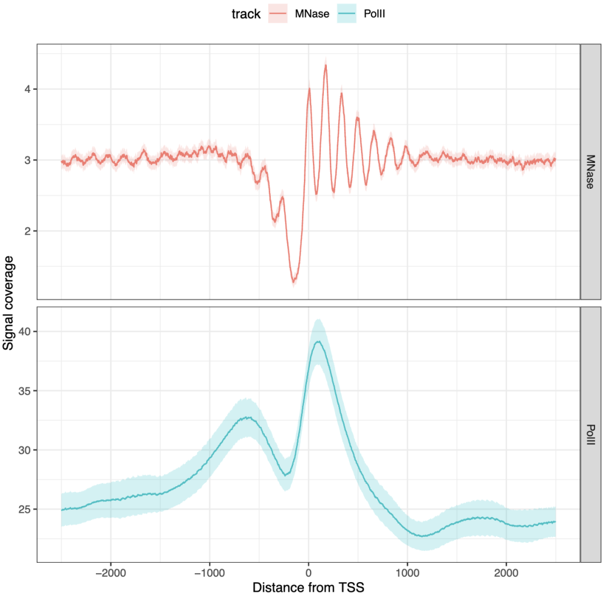
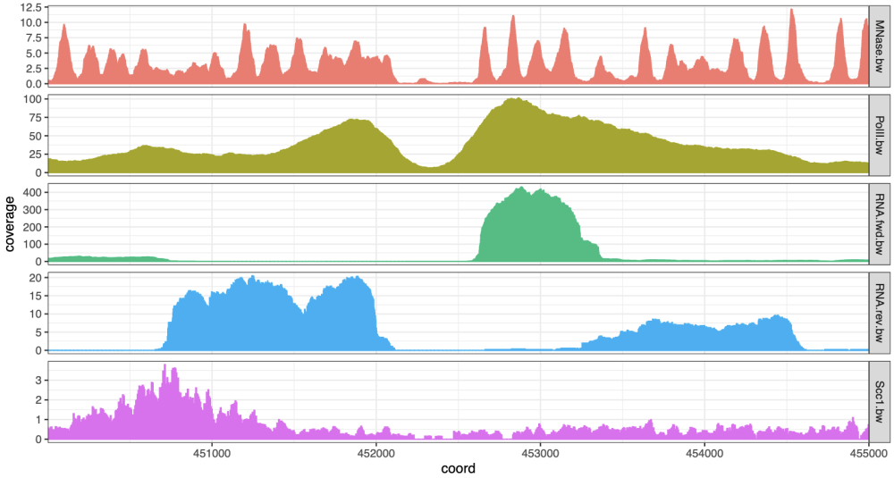

# tidyCoverage

The `tidyCoverage` R package provides a framework for rapid investigation of collections of genomic tracks over genomic features, relying on the principle of tidy data manipulation. It relies on `CoverageExperiment` and `AggregatedCoverage` classes, directly extending the `SummarizedExperiment` fundamental class,

## Installation 

In `R >= 4.4` and `Bioconductor >= 3.19`: 

```r
if (!require("BiocManager", quietly = TRUE))
    install.packages("BiocManager")

BiocManager::install("tidyCoverage")
```

## Load libraries and example datasets

```r
library(tidyCoverage)
library(tidySummarizedExperiment)
library(rtracklayer)
library(plyranges)
library(purrr)
library(ggplot2)

# ~~~~~~~~~~~~~~~ Import genomic features into a named list ~~~~~~~~~~~~~~~ #
features <- list(
    TSSs = system.file("extdata", "TSSs.bed", package = "tidyCoverage"),
    conv_sites = system.file("extdata", "conv_transcription_loci.bed", package = "tidyCoverage")
) |> map(~ import(.x))

# ~~~~~~~~~~~~ Import coverage tracks into a `BigWigFileList` ~~~~~~~~~~~~~ #
tracks <- list(
    Scc1 = system.file("extdata", "Scc1.bw", package = "tidyCoverage"), 
    RNA_fwd = system.file("extdata", "RNA.fwd.bw", package = "tidyCoverage"),
    RNA_rev = system.file("extdata", "RNA.rev.bw", package = "tidyCoverage"),
    PolII = system.file("extdata", "PolII.bw", package = "tidyCoverage"), 
    MNase = system.file("extdata", "MNase.bw", package = "tidyCoverage")
) |> BigWigFileList()
```

## Extract coverage for each track over each set of features

```r
CE <- CoverageExperiment(tracks, features, width = 5000, ignore.strand = FALSE) 
```

## Plot tracks coverage aggregated over genomic features

```r
CE |> 
    filter(track %in% c('MNase', 'PolII')) |> 
    filter(features == 'TSSs') |> 
    aggregate() |> 
    ggplot() + 
    geom_aggrcoverage(aes(col = track)) + 
    facet_grid(track ~ ., scales = "free") + 
    labs(x = 'Distance from TSS', y = 'Signal coverage')
```



## Plot coverage over a single locus

```r
CoverageExperiment(tracks, GRanges("II:450001-455000")) |> 
    expand() |> 
    ggplot() + 
    geom_coverage(aes(fill = track)) + 
    facet_grid(track~., scales = 'free')
```



## Related projects

A number of `CRAN`, `Bioconductor` or `GitHub` packages already exist to enable genomic track 
data visualization, for instance: 

- `Gviz` [\[Bioconductor\]](https://www.bioconductor.org/packages/release/bioc/html/Gviz.html)
- `soGGi` [\[Bioconductor\]](https://www.bioconductor.org/packages/release/bioc/html/soGGi.html)
- `GenomicPlot` [\[Bioconductor\]](https://www.bioconductor.org/packages/release/bioc/html/GenomicPlot.html)
- `plotgardener` [\[Bioconductor\]](https://www.bioconductor.org/packages/release/bioc/html/plotgardener.html)
- `genomation` [\[Bioconductor\]](https://www.bioconductor.org/packages/release/bioc/html/genomation.html)
- `ggcoverage` [\[GitHub\]](https://github.com/showteeth/ggcoverage)
- `GenomicScores` [\[Bioconductor\]](https://www.bioconductor.org/packages/release/bioc/html/GenomicScores.html)

Compared to these existing solutions, `tidyCoverage` directly extends `SummarizedExperiment` infrastructure and 
follows [tidy "omics" principles](https://www.biorxiv.org/content/10.1101/2023.09.10.557072v2). It does 
not directly provide **plotting** functionalities, but instead focuses on data recovery, structure and coercion, 
using a familiar grammar and standard representation of the data. 
This ensures seamless integration of genomic track investigation in exisiting 
`Bioconductor` and data analysis workflows. 
